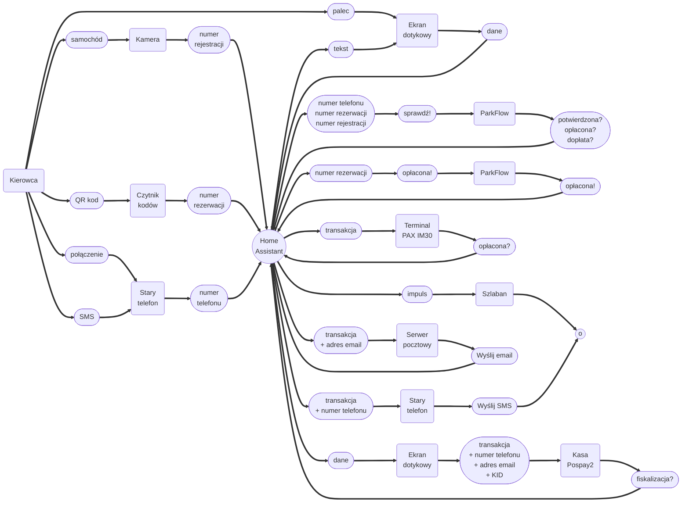
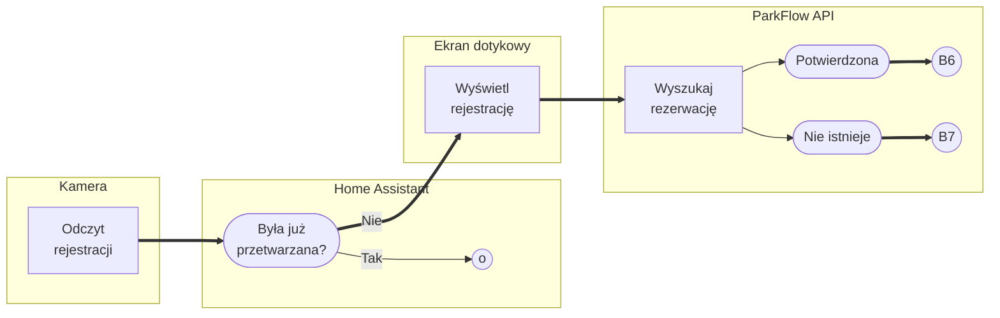
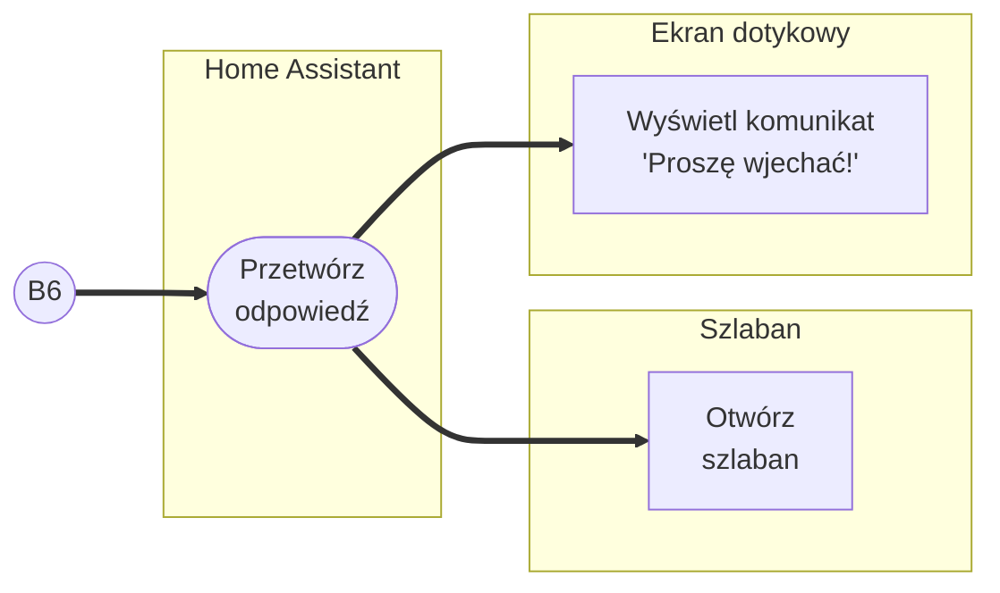
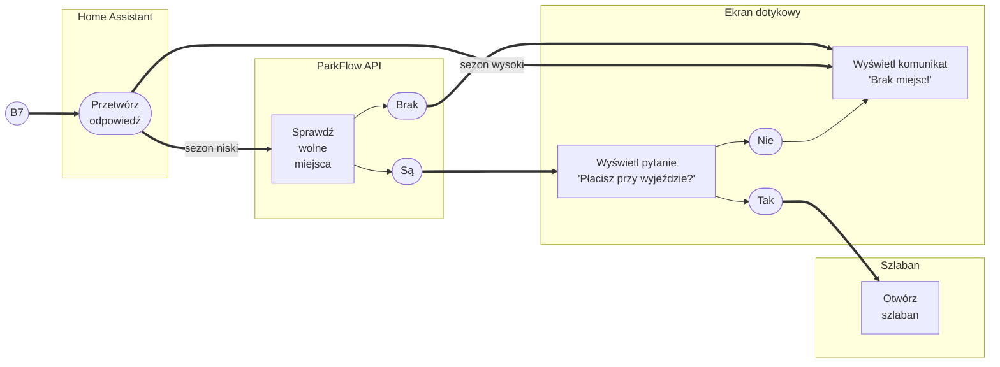

<!--suppress ALL -->

    

    

- [A. Relacje](#a-relacje)
    * [A1. Szlaban wjazdowy](#a1-szlaban-wjazdowy)
    * [A2. Szlaban wyjazdowy](#a2-szlaban-wyjazdowy)
- [B. Przepływy na szlabanie wjazdowym](#b-przep-ywy-na-szlabanie-wjazdowym)
    * [B1. Odczyt rejestracji samochodu przez kamerę ANPR](#b1-odczyt-rejestracji-samochodu-przez-kamer--anpr)
    * [B2. Odczyt QR-kodu przez czytnik QR](#b2-odczyt-qr-kodu-przez-czytnik-qr)
    * [B3. Wprowadzenie numeru rezerwacji na ekranie dotykowym](#b3-wprowadzenie-numeru-rezerwacji-na-ekranie-dotykowym)
    * [B4. Wykonanie połączenia na numer automatyczny](#b4-wykonanie-po--czenia-na-numer-automatyczny)
    * [B5. Wysłanie SMSa na numer automatyczny](#b5-wys-anie-smsa-na-numer-automatyczny)
    * [B6. Rejestracja jest potwierdzona](#b6-rejestracja-jest-potwierdzona)
    * [B7. Rejestracja nie istnieje](#b7-rejestracja-nie-istnieje)

# A. Relacje

## A1. Szlaban wjazdowy

## A2. Szlaban wyjazdowy

# B. Przepływy na szlabanie wjazdowym

## B1. Odczyt rejestracji samochodu przez kamerę ANPR

## B2. Odczyt QR-kodu przez czytnik QR

## B3. Wprowadzenie numeru rezerwacji na ekranie dotykowym

## B4. Wykonanie połączenia na numer automatyczny

## B5. Wysłanie SMSa na numer automatyczny

## B6. Rejestracja jest potwierdzona

## B7. Rejestracja nie istnieje

