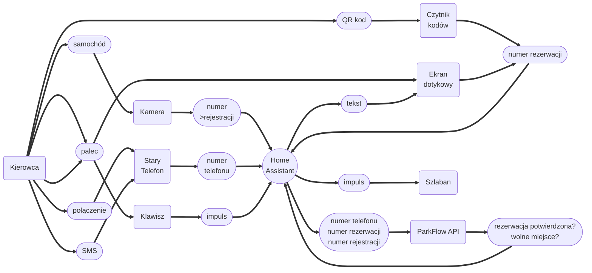
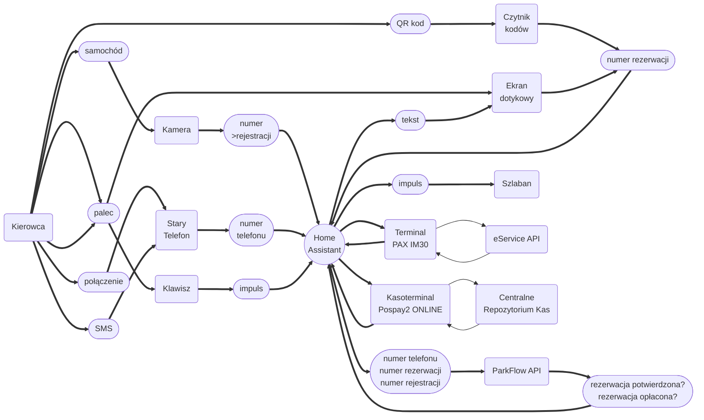

<!--suppress ALL -->

    

    

# Relacje

## Szlaban wjazdowy

```mermaid
flowchart LR
    actor(Kierowca) ==> eCar([samochód]) ==> iCam(Kamera)
    actor ==> eCode([QR kod]) ==> iQR(Czytnik<br />kodów)
    actor ==> eFinger([palec]) ==> iTS(Ekran<br />dotykowy)
    actor ==> eFinger ==> iBP(Klawisz)
    actor ==> ePhone([połączenie]) ==> iPH(Komórka)
    actor ==> eMess([SMS]) ==> iPH(Stary<br />Telefon)
    iCam ==> ePlate([numer<br />>rejestracji]) ==> HA((Home<br />Assistant))
    iQR ==> eID([numer rezerwacji]) ==> HA
    iTS ==> eID
    HA ==> eReq([tekst]) ==> iTS
    iPH ==> ePN([numer<br />telefonu]) ==> HA
    iBP ==> eTrig1([impuls]) ==> HA
    HA ==> eDS([numer telefonu<br />numer rezerwacji<br />numer rejestracji]) ==> apiPF(ParkFlow API)
    apiPF ==> eRS([rezerwacja potwierdzona?<br />wolne miejsce?]) ==> HA
    HA ==> eTrig2([impuls]) ==> G(Szlaban)
```

## Szlaban wyjazdowy

```mermaid
flowchart LR
    actor(Kierowca) ==> eCar([samochód]) ==> iCam(Kamera)
    actor ==> eCode([QR kod]) ==> iQR(Czytnik<br />kodów)
    actor ==> eFinger([palec]) ==> iTS(Ekran<br />dotykowy)
    actor ==> eFinger ==> iBP(Klawisz)
    actor ==> ePhone([połączenie]) ==> iPH(Komórka)
    actor ==> eMess([SMS]) ==> iPH(Stary<br />Telefon)
    iCam ==> ePlate([numer<br />>rejestracji]) ==> HA((Home<br />Assistant))
    iQR ==> eID([numer rezerwacji]) ==> HA
    iTS ==> eID
    HA ==> eReq([tekst]) ==> iTS
    iPH ==> ePN([numer<br />telefonu]) ==> HA
    iBP ==> eTrig1([impuls]) ==> HA
    HA ==> eDS([numer telefonu<br />numer rezerwacji<br />numer rejestracji]) ==> apiPF(ParkFlow API)
    apiPF ==> eRS([rezerwacja potwierdzona?<br />rezerwacja opłacona?]) ==> HA
    HA ==> eTrig2([impuls]) ==> G(Szlaban)
    HA ==> iTerm(Terminal<br />PAX IM30)
    iTerm --> apiES(eService API)
    apiES --> iTerm
    iTerm ==> HA
    HA ==> iCash(Kasoterminal<br />Pospay2 ONLINE)
    iCash --> apiCRK(Centralne<br />Repozytorium Kas)
    apiCRK --> iCash
    iCash ==> HA
```