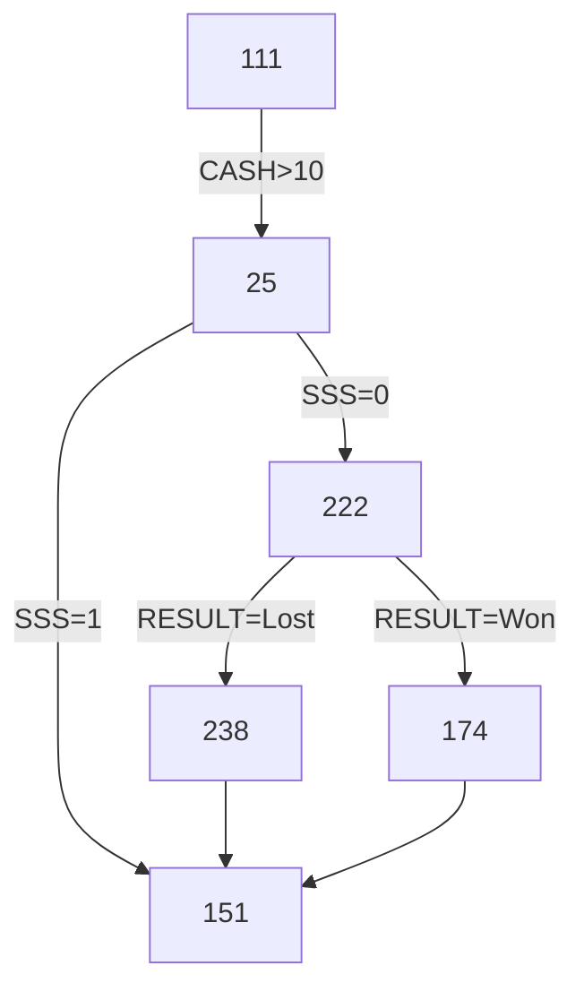

# Ogólna dokumentacja projektu ParkPal

- [Diagramy](#diagramy)
    * [Przykład](#przykład)
    * [Kod źródłowy](#kod-źródłowy)
    * [Narzędzia](#narzędzia)
    * [Inne typy diagramów](#inne-typy-diagramów)
    * [Usługa Kroki.io](#usługa-krokiio)

Ten wewnętrzny spis treści został wygenerowany przy użyciu [GitHub Wiki TOC generator](https://ecotrust-canada.github.io/markdown-toc/).

# Diagramy

Możemy używać [narzędzia MermaidJS dla JavaScriptu](https://mermaid.js.org/) w całym GitHubie (w [issues](https://github.com/ninergames/test-renpy-engine/issues/23), [discussions](https://github.com/ninergames/test-renpy-engine/discussions/21) oraz [w plikach tekstowych](https://github.com/ninergames/test-renpy-engine)).

## Przykład



Element `174` jest klikalny i prowadzi do → [https://mermaid.live/edit](https://mermaid.live/edit).

## Kod źródłowy

Czysty kod MermaidJS potrzebny do wygenerowania powyższego diagramu:

```
flowchart TD
    111 --> |CASH > 10| 25
    25 --> |SSS = 1| 151
    25 --> |SSS = 0| 222
    222 --> |RESULT = Won| 174
    222 --> |RESULT = Lost| 238    
    238 --> 151
    174 --> 151
    click 174 href "https://mermaid.live/edit
```

## Narzędzia

- Na https://mermaid.live/edit znajduje się edytor działający w locie, który renderuje kod MermaidJS podczas pisania.
- Użyj [mermaid.ink Generator](https://mermaid.ink/), aby „przekonwertować” (wyrenderować) kod MermaidJS do obrazu lub ciągu data-uri.

## Inne typy diagramów

- [Class Diagram](https://mermaid.live/edit#pako:eNptkc9OwzAMxl8l8glE-wIVF8SYxGGn3aZKyE28LmrijPzRBGPvTlrWMDZySfyzP-uLfQTpFEED0mAIC429R9uyyOeJtUUjHr_qWiySHG7pUofdLd1Q5_EPbsSD5iiwp2u8jl5zL3piRf4yOUrCCm1-3t1fJSxGmuFke7J3_AGiNO0Ih2dnnC-JcNB2FubwPaEc5vh02W_8WOlXj96D_qRXXhLFgiXyC8Z_9dMIfg11zhmhw9tBG1WgT1y0UIElb1GrvIlJ10LckaUWmvxUtMVkYgstj6WYolt_sIQm-kQVpL3KEznvboakdHR-dV7ueFWwR944l0u2aAKdvgFIMZyC)
- [Sequence Diagram](https://mermaid.live/edit#pako:eNptkLFqAzEMhl9F0VrfC9yQUujQFDp1K16E_V_OYFuJY1NCyLvXd9ds0fQjfZ9AurFTDx75gnNDdngPciySbKZebzE4DPv9y6fOeaQPxKi0ZEOz_pIU0FXb61N4w5zkBaEZUijhH11mQ0eH1emLw2YbOqzGSndt9xw_0AREOhZI3bHhhJIk-H7FbREs1xkJlscePSZpsVq2-d5RaVW_r9nxWEuD4XbyUh9HP5rwoWr52h6z_sfwSfKPakcmiRfc_wC26mTi)
- [Simple State Machine Diagram](https://mermaid.live/edit#pako:eNpdjz0LgzAQhv-K3Fh06ejQpV2d3No4HObUQD4kXoQi_vemCdJipofn3gv3btA7SVDDwsj0UDh6NNV6FbaI73Xpiqq6FS0rrbNKmGQcnlXjVmXHbDOf1__s3eMyZZvw-BRKMOQNKhnP2r4BATyRIQF1REkDBs0ChN1jFAO79m17qNkHKiHM8lfkkCQVO9_kpqlwCTPap3MxMqBeaP8ArztTOA)
- [Entity Relation Diagram](https://mermaid.live/edit#pako:eNp10VFrgzAQB_CvEu5Z-wF8KxqGMOeIttCRl8ycbUCNpLEw1O--WA1bO5a3HL_7J9yNUGmJEAGaRImzES3viDvxoSjzjDIyT7vdNJKEvqZHyk7hPkkYLQoSkYu4PtlpCkM9kpwl7hKRvhEV_mPSt2OextQpDo0Snw2SWhsOq_7z2lOywQrVzWf7rAVNP6jSNzQbWWu_QZiWNHNKdVUzSB_1zvLkEJdhvC_pS85OvmWr31M7K1T36B_-55M5aCPRoHRvcIAAWjStUNINe1y6OdgLtshhoRJrMTR2GcDsqBisLr66CiJrBgxg6KWwuG3IF1Eqq0227u--xgB60X1o7UgtmivO35Pxk64)
- [User Journey Diagram](https://mermaid.live/edit#pako:eNplULEKg0AM_ZWQ2aWULrdW6OTkVlyCl9arepEzR5HSf--pFSzNFN57eY-8F9ZiGQ0-JAbPU-UhjTrtGIoJnhJa5-9g6cuMXKsTDxcBlYVecYCCWgZlMnAyUPAGJ2EcRiUXRgPHPZOv9wYOM5rBmfQvo5F-72Tl6Tevn5TS6UJ-IzDDnkNPzqbPXrOoQm04eaFJq-UbxU4rrPw7SSmqlJOv0WiInGEcLCnnju6B-g1k61RCsZa1dJbhQP4qkiQ36kZ-fwCt22h_)
- [Pie Diagram](https://mermaid.live/edit#pako:eNo1j8sKwjAQRX8lzLobEaVka7eC6E6yGZtpDeRFMhFK6b8bLZnV5XDg3llhDJpAQjQk2LAlcSPOAnWITFq8FvEJtngmSll5UU_BEOasQEhx7M-NXZB31p8aujd0OEEHjpJDo2vV-hMU8JscKZA1apqwWFag_FZVLBweix9BcirUQYkamQaDc0LXIGnDIV339f8nOojonyFUZUKbafsCDfBG3g)

Diagram *User Journey* może być również używany np. do prezentowania wyników ankiet.

## Usługa Kroki.io

Możemy używać tej usługi do:

- Wszystkich typów diagramów, których MermaidJS nie obsługuje
- Diagramów, które z jakiegoś powodu chcemy generować w innym języku niż MermaidJS
- Diagramów, które w pewnych scenariuszach muszą być statycznym obrazem zamiast edytowalnego kodu

Niektóre inne diagramy (niedostępne w MermaidJS), które warto rozważyć:

- [Diagram składni w Pikchr](https://kroki.io/examples.html#syntax)
- [Diagram kontenerów w C4 PlantUML](https://kroki.io/examples.html#c4-container) (do rysowania architektur systemów)
- [Diagram komponentów w C4 PlantUML](https://kroki.io/examples.html#c4-component) (można użyć praktycznie do wszystkiego)
- [MindMap w PlantUML](https://kroki.io/examples.html#mind-map) (wygląda lepiej niż generowany w MermaidJS)

I wiele innych. Kroki.io obsługuje [ponad 20 języków](https://kroki.io/#support) i dla niektórych z nich (ale nie dla MermaidJS) pozwala renderować diagramy w formatach PDF, TXT lub jako strumienie zakodowane w base64.