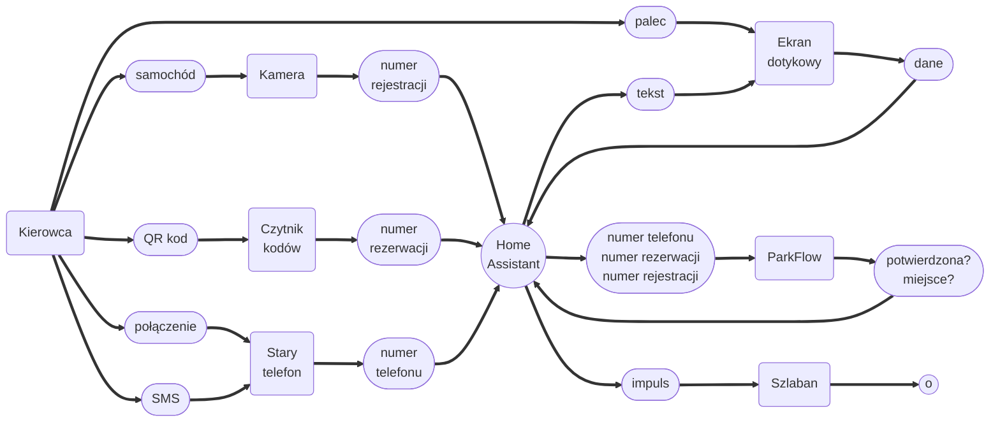
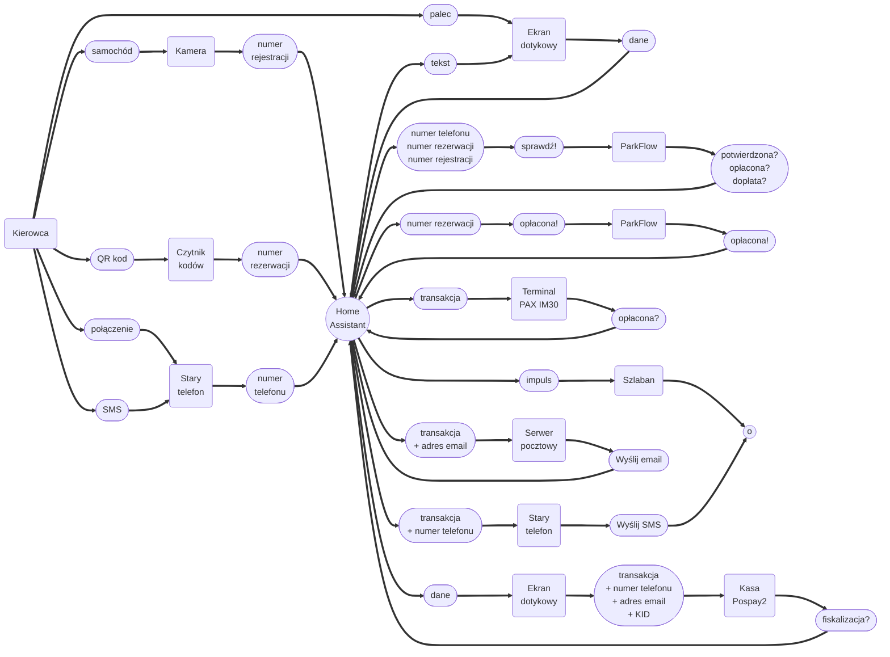

<!--suppress ALL -->

    

    

# Relacje

## Szlaban wjazdowy

```mermaid
flowchart LR
    actor(Kierowca) ==> eCar([samochód]) ==> iCam(Kamera)
    iCam ==> ePlate([numer<br />rejestracji]) ==> HA((Home<br />Assistant))
    
    actor ==> eCode([QR kod]) ==> iQR(Czytnik<br />kodów)
    iQR ==> eID([numer<br />rezerwacji]) ==> HA
    
    actor ==> eFinger([palec]) ==> iTS(Ekran<br />dotykowy)
    HA ==> eReq([tekst]) ==> iTS
    iTS ==> eText([dane]) ==> HA
    
    actor ==> ePhone([połączenie]) ==> iPH(Stary<br />telefon)
    actor ==> eMess([SMS]) ==> iPH
    iPH ==> ePN([numer<br />telefonu]) ==> HA
    
    HA ==> eDS([numer telefonu<br />numer rezerwacji<br />numer rejestracji]) ==> apiPF(ParkFlow)
    apiPF ==> eRS([potwierdzona?<br />miejsce?]) ==> HA
    
    HA ==> eTrig2([impuls]) ==> G(Szlaban) ==> End((o))
```

## Szlaban wyjazdowy

```mermaid
flowchart LR
    actor(Kierowca) ==> eCar([samochód]) ==> iCam(Kamera)
    iCam ==> ePlate([numer<br />rejestracji]) ==> HA((Home<br />Assistant))
    
    actor ==> eCode([QR kod]) ==> iQR(Czytnik<br />kodów)
    iQR ==> eID([numer<br />rezerwacji]) ==> HA
    
    actor ==> eFinger([palec]) ==> iTS(Ekran<br />dotykowy)
    HA ==> eReq([tekst]) ==> iTS
    iTS ==> eText([dane]) ==> HA
    
    actor ==> ePhone([połączenie]) ==> iPH(Stary<br />telefon)
    actor ==> eMess([SMS]) ==> iPH
    iPH ==> ePN([numer<br />telefonu]) ==> HA
    
    HA ==> eDS1([numer telefonu<br />numer rezerwacji<br />numer rejestracji]) ==> eCom1([sprawdź!]) ==> apiPF(ParkFlow)
    apiPF ==> eRS([potwierdzona?<br />opłacona?<br />dopłata?]) ==> HA

    HA ==> eDS2([numer rezerwacji]) ==> eCom2([opłacona!]) ==> apiPF2(ParkFlow)
    apiPF2 ==> eRS2([opłacona!]) ==> HA
    
    HA ==> eTrig2([impuls]) ==> G(Szlaban) ==> End((o))

    HA ==> eReq1([transakcja<br />+ numer telefonu]) ==> iPH2(Stary<br />telefon)
    iPH2 ==> eResp1([Wyślij SMS]) ==> End
    
    HA ==> eReq2([transakcja]) ==> iTerm(Terminal<br />PAX IM30)
    iTerm ==> eResp2([opłacona?]) ==> HA
    
    HA ==> eText2([dane]) ==> iTS2(Ekran<br />dotykowy) ==> eReq3([transakcja<br />+ numer telefonu<br />+ adres email<br />+ KID]) ==> iCash(Kasa<br />Pospay2)
    iCash ==> eResp3([fiskalizacja?]) ==> HA
    
    HA ==> eReq4([transakcja<br />+ adres email]) ==> iSMTP(Serwer<br />pocztowy)
    iSMTP ==> eResp4([Wyślij email]) ==> HA
```